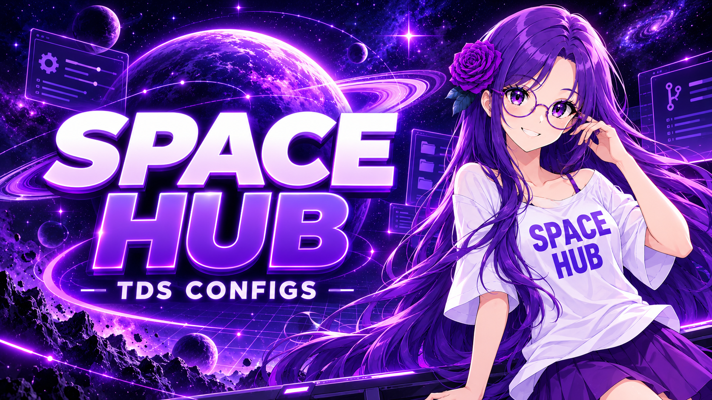

<div align="center">



# Space Hub · TDS Configs

**A curated collection of Tower Defense Simulator strategies.**

Find a mode, choose a map, and open a ready-to-use strategy in just a few clicks.

**📦 858 strategies &nbsp; • &nbsp; 🎮 14 categories &nbsp; • &nbsp; 🗺️ Sorted by map**

[](#-strategy-catalog)

</div>

<h2 align="center">🔎 Find a strategy</h2>

<p align="center">Choose a category below, open the required map, then select a numbered strategy.<br>Use <b>Ctrl+F</b> on any index page to quickly find a map, tower, modifier, or mode.</p>

<h2 align="center">📚 Strategy catalog</h2>

<div align="center">

| Mode | Strategies | Open |
|:---:|---:|:---:|
| **Story** | 2 | [Browse →](Story/README.md) |
| Fallen | 120 | [Open](Fallen/README.md) |
| **Casual** | 39 | [Browse →](Casual/README.md) |
| **Intermediate** | 29 | [Browse →](Intermediate/README.md) |
| Easy | 141 | [Open](Easy/README.md) |
| Molten | 76 | [Open](Molten/README.md) |
| **Frost** | 167 | [Browse →](Frost/README.md) |
| **Badlands** | 3 | [Browse →](Badlands/README.md) |
| **Hardcore** | 211 | [Browse →](Hardcore/README.md) |
| **Voidcore** | 2 | [Browse →](Voidcore/README.md) |
| **Event** | 31 | [Browse →](Event/README.md) |
| **Trials** | 17 | [Browse →](Trials/README.md) |
| **Sandbox** | 26 | [Browse →](Sandbox/README.md) |
| **Unknown** | 1 | [Browse →](Unknown/README.md) |

| Act1Easy | 2 | [Open](Act1Easy/README.md) |
| Act1 | 1 | [Open](Act1/README.md) |
| Hardcore Hard | 1 | [Open](Hardcore%20Hard/README.md) |
</div>

---

<h2 align="center">🚀 How do I use a recorded or downloaded TDS macro?</h2>

<p align="center">Download the required macro file, put it into <code>executor/autoexec</code>, and rename it to <code>config.lua</code>.<br>Make sure every file is in the correct folder, or the macro will not run properly.</p>

---

<h2 align="center">🏆 Can TDS restart automatically after Triumph?</h2>

<p align="center"><b>No.</b> TDS does not allow an automatic restart after Triumph.<br>After a win, the available flow is to rejoin.</p>

---

<h2 align="center">🗂️ Repository structure</h2>

<p align="center"><code>Mode / Map / Number-Timestamp.txt</code></p>

<p align="center">Event, Trial, and Story strategies include one extra category level.<br>Numbers are assigned separately for every map, in chronological order.</p>

```text
Easy/
└── Abyssal Trench/
    ├── 1-2026-08-31-17-46-50.txt
    ├── 2-2026-08-31-17-46-56.txt
    └── README.md
```

---

<p align="center"><sub>Maintained automatically by <b>Space Hub API Service</b> 💜</sub></p>
